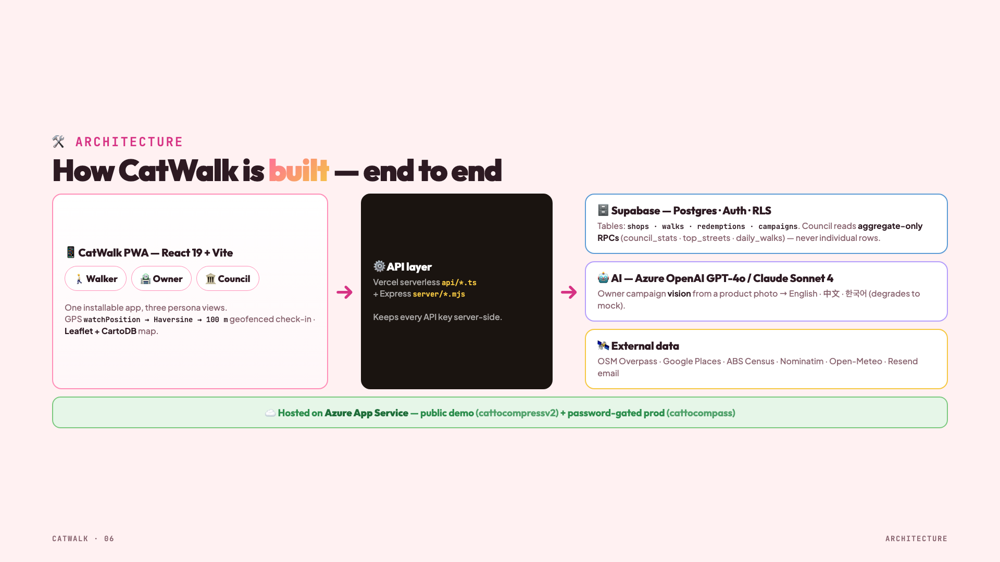
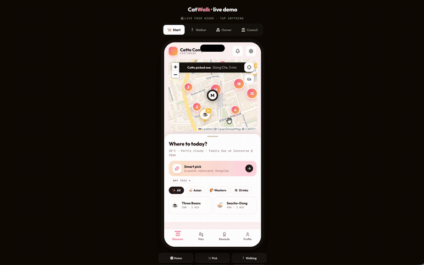
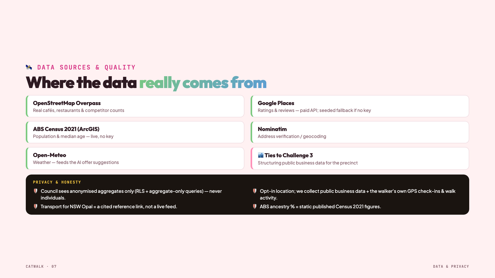
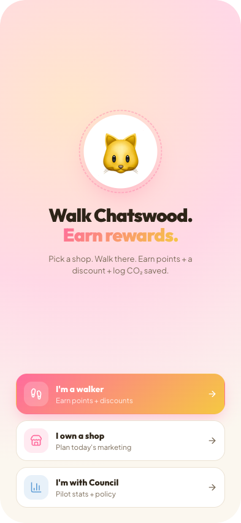
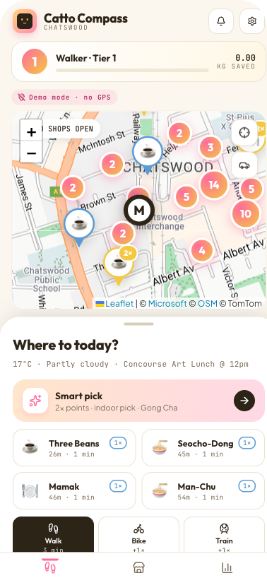
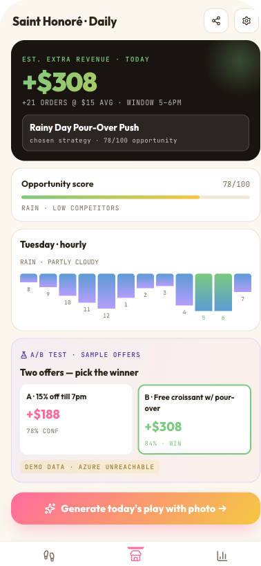
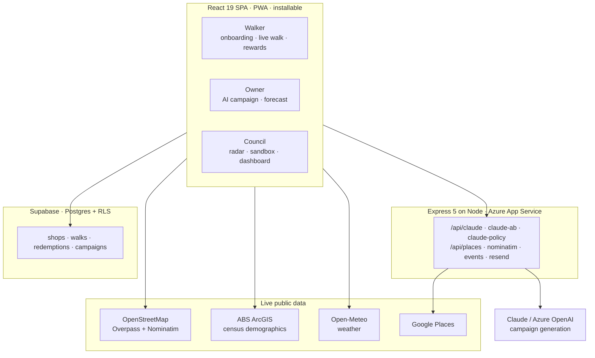
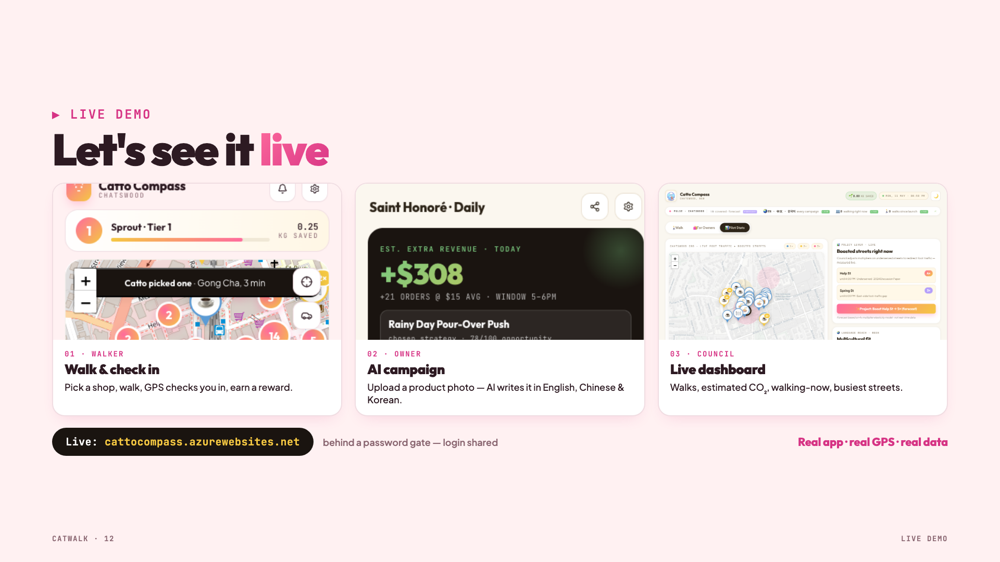

<h1>CatWalk</h1>

<p>
  <strong>🏆 1st Place — Chatswood “AI for Real-World Impact” Hackathon, 16 May 2026</strong><br>
  Willoughby City Council × GEEQ · Challenge: <em>Sustainable Last Mile Transport</em>
</p>

> **The last mile, made rewarding.**
> Turn every verified walk into a reward for the resident, foot traffic for the shop,
> and an anonymised movement signal for Council.

Designed and built end-to-end — architecture, full-stack app, AI integration, and deployment.
Won 1st place at the Chatswood Hackathon with **Team CatWalk**.

<p align="center">
  
</p>

## See it running

<p align="center">
  
</p>

<div align="center">

**[▶ Full 76-second walkthrough](docs/catwalk-demo.mp4)** ·
**[Live app](https://cattocompressv2.azurewebsites.net)** ·
**[Demo video on Facebook](https://www.facebook.com/reel/1636653097607330)**

</div>

<p align="center">
  
</p>

---

## The problem

People drive for trips that are a few minutes on foot. Councils have no live picture of how
local high streets are actually doing, and small shops have no cheap way to reach the people
already walking past them.

Three separate problems, one shared cause: **local movement generates no data anyone can act on.**

## The approach

One app, three roles on the same data:

| Role | What they do | What they get |
|---|---|---|
| 🚶 **Walker** | Pick a partner shop, walk there, check in via GPS geofence | Points, rewards, CO₂ saved |
| 🏪 **Shop owner** | Upload a product photo | An AI marketing campaign in EN / 中文 / 한국어, generated from live weather, local events, ABS demographics and competitor density |
| 🏛️ **Council** | Open the dashboard | Live walks, CO₂ saved, top streets, business-health radar — **aggregate only, never an individual walker** |

> Residents move. Shops grow. Councils see impact.

<p align="center">
  
  
  
</p>

## Architecture



**13 screens** across the three roles, in `src/screens/`:
`OnboardingScreen` · `WalkerHomeScreen` · `WalkingLiveScreen` · `ParkAndWalkScreen` ·
`PlanDayScreen` · `SmartPickScreen` · `RewardScreen` · `RewardsHomeScreen` · `ProfileScreen` ·
`OwnerCampaignScreen` · `OwnerForecastScreen` · `RadarHomeScreen` · `CouncilSandboxScreen`

## Technical decisions & trade-offs

| Decision | Chosen | Why | Trade-off accepted |
|---|---|---|---|
| **GPS verification** | Client-side geofence (`src/lib/geofence.ts`, unit-tested) | Instant feedback, works offline, no server round-trip per position update | Spoofable — fine for a pilot, would need server-side attestation for real rewards |
| **Auth** | Supabase anonymous auth | Zero-friction — a resident walks without signing up | No cross-device history until they upgrade the account |
| **Access control** | Postgres RLS on all 4 tables, not app-layer checks | The database refuses the query even if a client is compromised | Policies must be written and reviewed carefully; harder to debug than app-layer guards |
| **Map** | Leaflet + OpenStreetMap (CartoDB tiles) | Free, no API key, real tiles for a real suburb | Fewer built-ins than Google/Azure Maps; heat + cluster added via plugins |
| **AI provider** | Claude, with Azure OpenAI as the alternate path | Better multilingual campaign copy for EN/中文/한국어 | Two code paths to keep working (`api/claude.ts`, `api/claude-policy.ts`) |
| **Prompt strategy** | Two campaign variants scored against each other in `src/lib/ai-ab.ts` — each returns predicted revenue + confidence, and the layer picks a winner; guardrails live in `ai-policy.ts` | Campaign copy *is* the product for a shop owner, so it needed to be comparable rather than a single unverifiable generation | Extra indirection, and the prediction model is heuristic — not trained on outcomes |
| **Data** | Real public sources only (ABS, Open-Meteo, Overpass, Google Places) | Council can verify every number against its own sources | Slower to build than mock data; external APIs can rate-limit mid-demo |
| **Hosting** | Single Express server serving the SPA + API on Azure App Service | One deploy unit, one log stream, no CORS | No edge distribution; cold starts on the shared B1 plan |

## Privacy & security

- **Council surfaces are aggregate-only.** No screen exposes an individual walker's identity or path.
- **RLS on every table.** `shops` is public-read; `walks` and `redemptions` are select/insert
  restricted to the owning user; `campaigns` are scoped to the owning shop.
  See `supabase/migrations/0001_initial_schema.sql`.
- **No secrets in the client.** Only the Supabase anon key ships to the browser (RLS enforced);
  LLM keys stay server-side behind `/api/*`.
- `.env.local` is git-ignored; `.env.example` documents every variable with empty values.

## Testing

| Layer | Tool | What it covers |
|---|---|---|
| Unit | Vitest + Testing Library | `geofence.test.ts` (check-in radius maths), `insights.test.ts` (council aggregates), `smartPick.test.ts` (shop recommendation) |
| E2E | Playwright | `e2e/happy-path.spec.ts` — 9 specs across all three roles: boot with **zero console errors**, onboarding role-pick, walker map + smart-pick + shop rail, basket → plan hydration, owner campaign state **persisting across reload**, council pulse and trajectory charts in light and dark |
| Types | `tsc -b --noEmit` | Strict TypeScript across `src/` and `api/` |
| Lint/format | ESLint 10 + Prettier | Enforced in CI |

The E2E suite asserts accessibility properties directly — the plan picker sheet is checked for a
correct ARIA role and for being dismissible by keyboard, not just for rendering.

```bash
npm ci
npm run typecheck && npm run lint && npm test && npm run test:e2e
```

CI (`.github/workflows/ci.yml`, `deploy.yml`) runs typecheck → unit tests → build on every push, then
deploys to Azure and polls `/api/health` before finishing. The Playwright suite runs locally, not in CI.

## Council vision alignment

Built against *Our Future Willoughby 2036*:

<p align="center">
  
</p>

## What I'd do differently

- **Server-side walk verification.** Client geofencing is spoofable; real rewards need
  server-verified position sequences with speed/plausibility checks.
- **Push the AI campaign generation to a queue.** It runs inline today, so a slow LLM call
  blocks the owner's request. A job + polling would survive rate limits.
- **Cache the external data.** ABS and Overpass are queried live per session; a nightly
  materialised snapshot in Postgres would cut latency and remove the demo-day risk.
- **Split the Express server.** It serves static, proxies AI, and handles email in one process.
  Fine for a hackathon, wrong for anything with real traffic.

## Run locally

```bash
cp .env.example .env.local   # fill in Supabase + LLM keys
npm ci
npm run dev
```

Deployment steps and custom-domain setup are in [DEPLOY.md](DEPLOY.md).

## Stack

React 19 · TypeScript 6 · Vite 8 · Supabase (Postgres + RLS + anon auth) · Leaflet + OpenStreetMap ·
Express 5 · Claude / Azure OpenAI · Playwright · Vitest · PWA · Azure App Service

---

<sub>Built for the Chatswood “AI for Real-World Impact” Hackathon (16 May 2026) and iterated afterwards.
It is a hackathon prototype demonstrating the idea, the UX and the data model — not a production
service with live council data.</sub>
